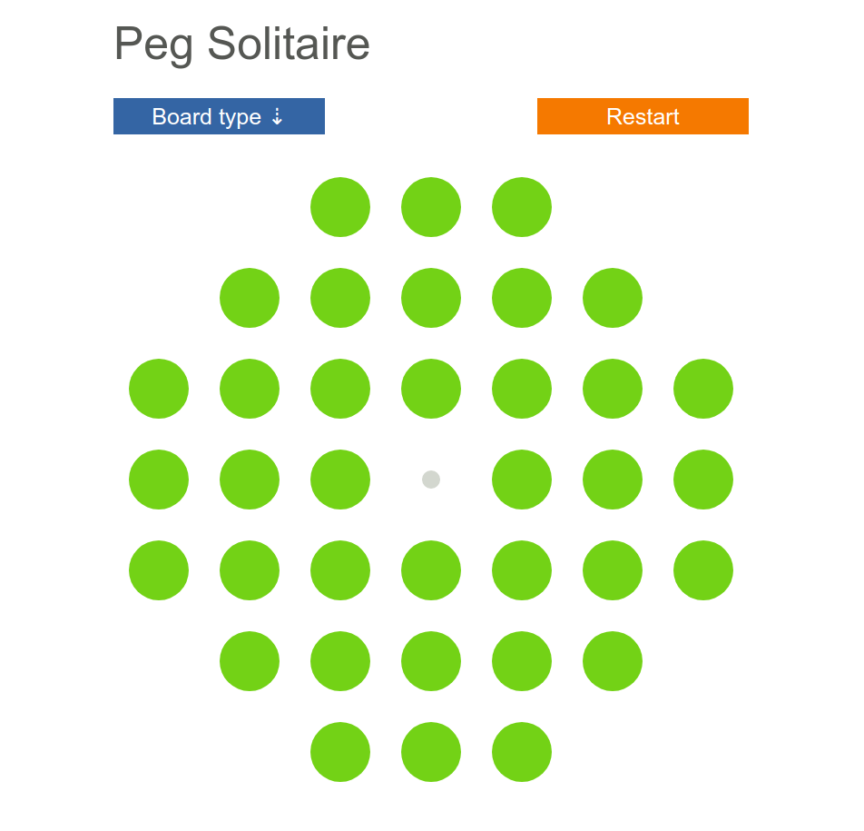

# Peg Solitaire


This is a simple version of the [*Peg Solitaire*](https://en.wikipedia.org/wiki/Peg_solitaire) game. It support multiple basic board shapes and that's about it! :-)

I wrote this game in order to learn bit more about Elm and in particular about the HTML5 drag and drop mechanics.

The game is available online at [http://peg.basilehenry.com/](http://peg.basilehenry.com/).



## How to play

Use your mouse to drag and drop the pegs. You have to move peg to an empty
space, and only when they go over another peg. This other peg then goes away.
Try to get as few pegs left as possible!

## How to build

The game is written in [Elm](http://elm-lang.org/) so you'll need elm-make:

```sh
elm make src/Main.elm --output index.html
```

Or even simpler, use `elm reactor` and then open `http://localhost:8000/` in your browser.

## Room for improvement

I had a few more ideas for improving the game (if I ever get around to):

- Better drag and drop animation (hide the peg that is being dragged)
- Display `"Game Over"` when the game cannot progress further
- Let the player create their own board shape

## License

[MIT License](LICENSE)

Copyright (c) 2018 Basile Henry
